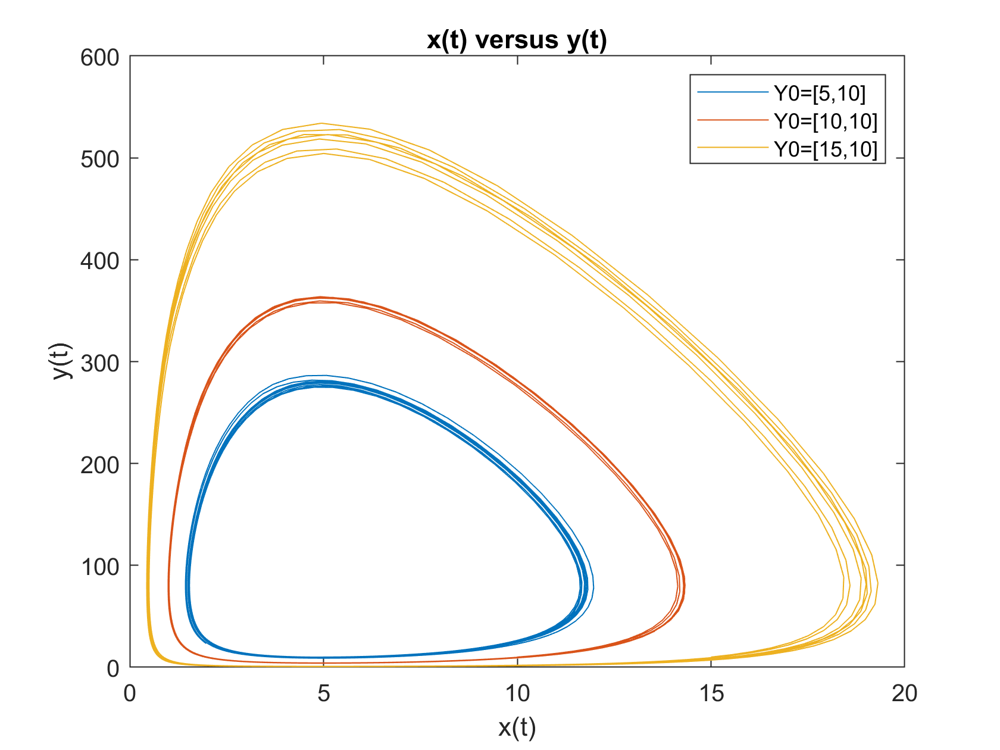

This program solves the Lotka-Volterra differential equations to model a predator-prey relationship and outputs 2 figures.

Figure 1 shows population of the two species over time.

Figure 2 shows population as a function of time of prey, x(t), and population as a function of time of predator, y(t), plotted against each other.

